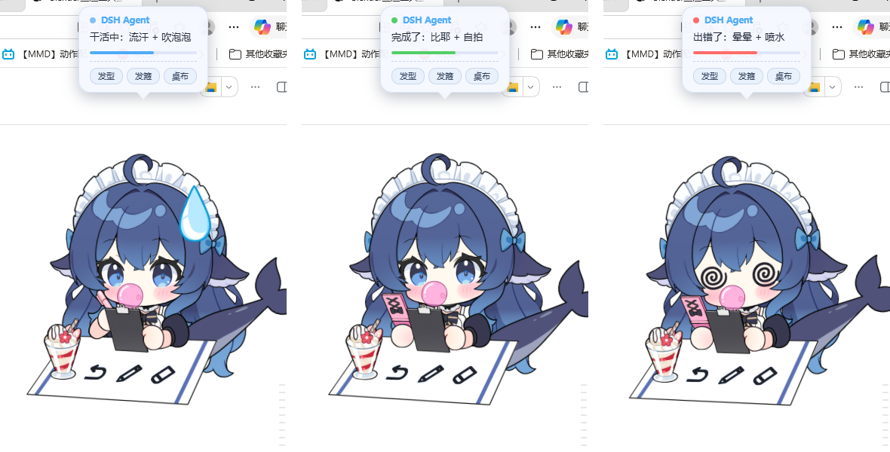
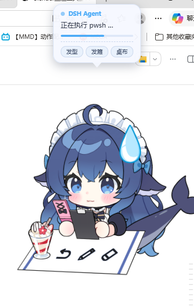

# DSH Desktop Pet · Live2D 桌宠

一只住在桌面上的**透明、置顶、无边框** Live2D 桌宠，用来实时显示
[DeepSeek Harness](https://github.com/deepseek-ai/deepseek-harness) agent
正在做什么 —— 全屏干活时也能看到它是在思考、在忙、还是卡住了。



## 它能做什么

| 能力 | 说明 |
|---|---|
| **透明置顶** | Electron 原生窗口，`transparent + frame:false + alwaysOnTop`，切换全屏应用也看得见 |
| **状态实时联动** | 插件监听 harness 的 `session/event`，气泡显示「正在执行 pwsh …」，Live2D 表情同步切换 |
| **三种情绪** | `working` 头上一滴大汗 / `done` 眯眼笑 / `error` 圈圈眼 |
| **桌布彩蛋** | 桌上画着的三个图案是可点的，循环切换 **造型 / 蛋包饭 / 桌布** |
| **44 个表情 + 8 个动作** 全部接入 | 从模型的 `.exp3.json` / `.motion3.json` 逐条接进 `model3.json` |



## 组成

```
dsh-pet-bridge/     DSH 插件：把 agent 状态写进 pet_state.json
docs/               截图
```

桌宠本体（Electron + Live2D 模型）在 **Releases** 里下载。

## 安装

### 1. 桌宠本体

下载 Releases 中的 `DSH桌宠_Live2D版.zip`（约 150 MB，Electron 运行时已内置）：

1. 解压到任意目录
2. 双击 `创建桌面快捷方式.bat`（只需一次）
3. 以后双击桌面的「DSH桌宠」即可

**不需要**装 Node.js、不需要装浏览器、不需要联网。

### 2. DSH 插件（状态联动）

```bash
dsh plugin --profile web add "file:<解压后的 dsh-pet-bridge 绝对路径>"
```

然后**重启 `dsh web`**。

> ⚠️ `file:` 安装是**复制**而非符号链接 —— 改了插件源码后必须重新 `add` 一次
> （或改 `package.json` 的 version 触发 pnpm 更新），否则改动不生效。

## 工作原理

```
agent 思考 / 调工具 / 完成 / 出错
      ↓
[dsh-pet-bridge]  监听 session/event，node:fs 直写
      ↓
pet_state.json    {"bubble":"正在执行 pwsh …","status":"working"}
      ↓
[Electron 主进程]  读文件 → IPC 推给页面
      ↓
[pet.html]        文字 + 配色 + 进度条
      ↓
[Live2D]          流汗 / 眯眼笑 / 圈圈眼
```

**为什么不用 WPF + WebView2**：WPF 的 `AllowsTransparency=True` 是 layered window，
承载不了 WebView2 的子 HWND —— 结果是 WPF 自绘的阴影正常显示、WebView2 内容永远空白。
Electron 把这三件事一次性解决了。

## 版权

**程序代码** MIT，见 [LICENSE](LICENSE)。

**Live2D 模型「DS鲸鱼娘」版权不属于本项目**：
- 作者：B站 **@氵六青** (uid 11272072)
- 授权：无偿分享；可商用直播、可自印物料
- **禁止：任何形式的盗用与出售**

转发时请保留此声明，也不要把模型单独提取出来另行分发或售卖。

Live2D Cubism Core 版权归 Live2D Inc. 所有。