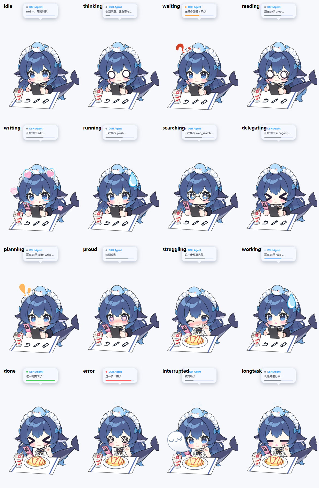
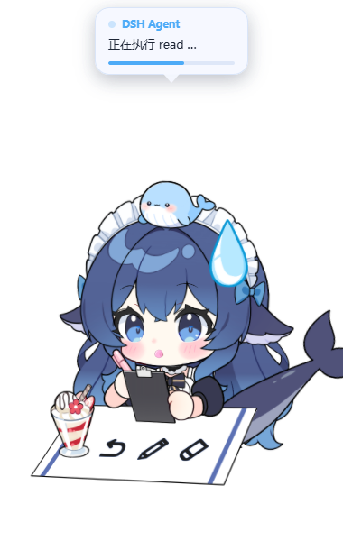
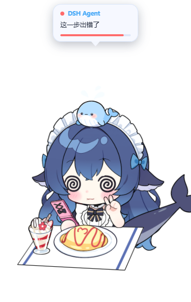
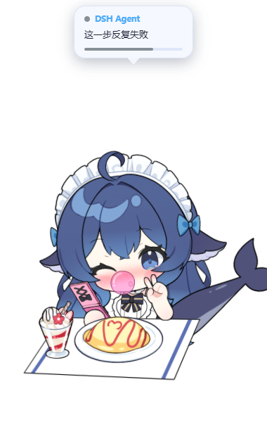

# DSH Desktop Pet · Live2D 桌宠

一只住在桌面上的**透明、置顶、无边框** Live2D 桌宠，用来实时显示
[DeepSeek Harness](https://github.com/deepseek-ai/deepseek-harness) agent
正在做什么 —— 全屏干活时也能看到它是在思考、在忙、还是卡住了。



## 它能做什么

| 能力 | 说明 |
|---|---|
| **透明置顶** | Electron 原生窗口，`transparent + frame:false + alwaysOnTop`，切换全屏应用也看得见 |
| **状态实时联动** | 插件监听 harness 的 `session/event`，气泡显示「正在执行 pwsh …」，Live2D 表情同步切换 |
| **16 种状态** | 不只"在忙"：读文件 / 写代码 / 跑命令 / 联网搜索 / 派子代理 / 列计划 / 连续顺利 / 反复失败 / 被打断 / 长任务，各有自己的表情与动作 |
| **动作有节奏** | 每个长状态配一组语义相容的动作池并轮换（±15% 抖动），不会一直吹泡泡；出错/被打断这类瞬间只演一次 |
| **表情不被动作带跑** | 表情与动作独立选择，表情永远不从动作推导 —— 身体在动，脸是稳的 |
| **不会混搭素材** | 模型有两套名字很像的泡泡系统（`chuipaopao*` 泡泡糖 / `paopao*` 泡泡，而 `paopao4/5` 其实是蝴蝶结），状态切换时会一起释放，不会出现「晕晕 + 嘴含泡泡」的怪画面 |
| **小鲸鱼陪伴** | 头顶那条小鲸鱼默认常驻，16 个状态全程陪着（模型自带的 `jingyu`） |
| **参数不靠猜** | 模型自带 `cdi3.json`，用中文写明了全部 247 个参数的名字（`chuipaopao3`=泡泡出现、`jingyu`=鲸鱼、`maoshou2-7`=猫手…），改参数前先查它 |
| **换装系统** | 悬停气泡浮出四个槽位：头饰 · 眼镜 · 贴纸 · 桌面，共 20 个素材可叠加 |
| **装扮自动穿脱** | 「读文件」自动戴眼镜、「写代码」自动贴贴纸；手动选过的槽位不再被状态抢占 |
| **44 个表情 + 7 个动作** 全部接入 | 18 个表情用作情绪、20 个用作装扮，7 个动作全用上（不切分） |
| **自带验证器** | `electron\electron.exe verify` 跑完 16 态、截图、逐参数核对，当前 16/16 通过 |


### v1.1 的几个状态

| 干活中（会吹泡泡糖 + 转动作） | 读文件（自动戴眼镜） |
|---|---|
|  |  |

| 晕晕（圈圈眼，嘴里**没有**泡泡） | 反复失败（脸红 + 挤番茄酱） |
|---|---|
|  |  |

头顶那条小鲸鱼是模型自带的 `jingyu` 参数，默认常驻，16 个状态全程陪着。

## 组成

```
dsh-pet-bridge/     DSH 插件：把 agent 状态写进 pet_state.json
docs/               截图
```

桌宠本体（Electron + Live2D 模型）在 **Releases** 里下载。

## 安装

### 1. 桌宠本体

下载 Releases 中的 `DSH桌宠_Live2D版.zip`（约 150 MB，Electron 运行时已内置）：

1. 解压到任意目录
2. 双击 `创建桌面快捷方式.bat`（只需一次）
3. 以后双击桌面的「DSH桌宠」即可

**不需要**装 Node.js、不需要装浏览器、不需要联网。

### 2. DSH 插件（状态联动）

```bash
dsh plugin --profile web add "file:<解压后的 dsh-pet-bridge 绝对路径>"
```

然后**重启 `dsh web`**。

> ⚠️ `file:` 安装是**复制**而非符号链接 —— 改了插件源码后必须重新 `add` 一次
> （或改 `package.json` 的 version 触发 pnpm 更新），否则改动不生效。

## 工作原理

```
agent 思考 / 调工具 / 完成 / 出错
      ↓
[dsh-pet-bridge]  监听 session/event，按工具名细分状态，node:fs 直写
      ↓
pet_state.json    {"bubble":"正在执行 read …","status":"reading"}
      ↓
[Electron 主进程]  读文件 → IPC 推给页面
      ↓
[pet.html]        文字 + 配色 + 进度条 + 换装槽位
      ↓
[Live2D]          呆呆眼+眼镜 / 调皮+贴纸 / 星星眼 / 爱心眼 …
```

### 表情为什么不会"串味"

动作曲线和表情写的是**不同的参数**，但并不完全不相交 —— 比如「番茄酱」
动作会写 `ParamCheek21`。如果表情在动作之前写，就会被动作覆盖，表现为
上一个状态的表情残留到下一个状态（v1.0 就有的隐藏 bug）。

所以 `pet.html` 每帧都在 `internalModel.update()` **返回之后**重写一次
表情与装扮参数；切状态时则强制抹掉全部表情参数（而不是只抹上一个表情
用到的那些 —— 各表情的参数列表并不相同）。

这类问题肉眼几乎看不出来，所以仓库里带了一个验证器：

```bash
electron\electron.exe verify
```

它把桌宠跑起来、切到 16 个状态、逐个截图，再直接读模型参数核对
"这个状态是不是只开了它该开的参数"；另外还会停在几个长状态上守十几秒，
确认动作真的在轮换而不是重播同一段 —— 当前结果：

```
STRICT CHECK  (face + auto-outfit params only; motion-driven params ignored)
  passed = 16   failed = 0
  motion scheduler: 5/5 states behave
hard errors = 0
```

动作调度的一句实测输出：

```
working  pool=[0,0,2]  fired 5x  seq=[吹泡泡 > 吹泡泡 > 开盖 > 吹泡泡 > 吹泡泡]
```

表情参数在同一段时间里**零漂移** —— 证明"身体在动、脸不动"这条成立。

**为什么不用 WPF + WebView2**：WPF 的 `AllowsTransparency=True` 是 layered window，
承载不了 WebView2 的子 HWND —— 结果是 WPF 自绘的阴影正常显示、WebView2 内容永远空白。
Electron 把这三件事一次性解决了。

## 版权

**程序代码** MIT，见 [LICENSE](LICENSE)。

**Live2D 模型「DS鲸鱼娘」版权不属于本项目**：
- 作者：B站 **@氵六青** (uid 11272072)
- 授权：无偿分享；可商用直播、可自印物料
- **禁止：任何形式的盗用与出售**

转发时请保留此声明，也不要把模型单独提取出来另行分发或售卖。

Live2D Cubism Core 版权归 Live2D Inc. 所有。